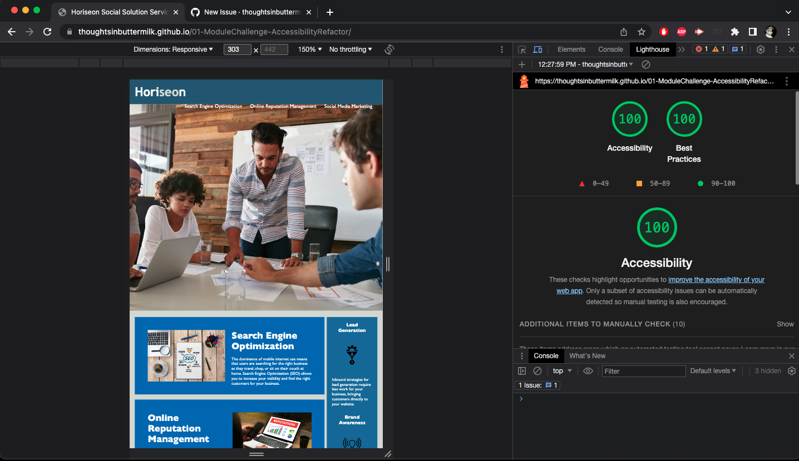

# Northwestern Full Stack Development Bootcamp Assignment 01

# Project description

The goal of this project is to refactor an existing website to be compliant with accessibility standards and tools. The original source code was provided as part of the assignment. The requirement is to refactor the sources without changing the useability or display of the site. This assignment is due Monday, 05 June (12:59 p.m.). 

## User story
As a marketing agency, I want a codebase that follows accessibility standards so that our own site is optimized for search engines.

## Acceptance criteria (_requirements_)
Given a webpage meets accessibility standards:
* When I view the source code, then I find semantic HTML elements.
* When I view the structure of the HTML elements, then I find that the elements follow a logical structure independent of styling and positioning.
* When I view the image elements, then I find accessible alt attributes.
* When I view the heading attributes, then they fall in sequential order.
* When I view the title element, then I find a concise, descriptive title.

## Notes for Instructor, Teaching Assistants

The source code for this project is in the `main` branch. I have not deleted the working branches I used to iterate over the changes, organize the project etc., in case those are of interest to you. 

# References and tools used

**References**

• [Accessibility guidelines for websites](https://developer.mozilla.org/en-US/docs/Learn/Accessibility)

• [Semantics: HTML, CSS](https://developer.mozilla.org/en-US/docs/Glossary/Semantics)

**Tools**

• [Lighthouse, Chrome DevTools](https://developer.chrome.com/docs/lighthouse/overview/)

• [Apple VoiceOver (screen reader built into MacOS)](https://www.apple.com/voiceover/info/guide/_1121.html#:~:text=About%20VoiceOver&text=To%20turn%20on%20VoiceOver%2C%20press,using%20contracted%20or%20uncontracted%20braille.)

• [Inspector, Chrome Devtools](https://developer.chrome.com/docs/devtools/overview/)

• [Visual Studio Code](https://code.visualstudio.com/learn)

**Reference image**

Below, a reference imagee of the original source code rendered in Google Chrome. Note: The refence image below does not include the site's footer.

# Deployment, usage

The html site has been deployed using [Github Pages](https://pages.github.com/) and can be viewed in a web browser or screen reader. 

# Accessibility report

# Future updates

The repository will be updated after the project is graded; all feedback will be incorporated. I also plan to refactor the css to consolidate and reuse duplicated styles and properties.

## Author

[**Sam Bailey**](https://github.com/thoughtsinbuttermilk) [Shoot me an email!](mailto:thoughtsinbuttermilk@gmail.com) [Or visit my website!](http://www.thoughtsinbuttermilk.com)

